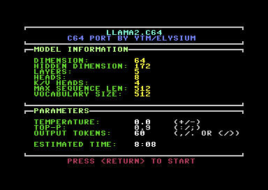
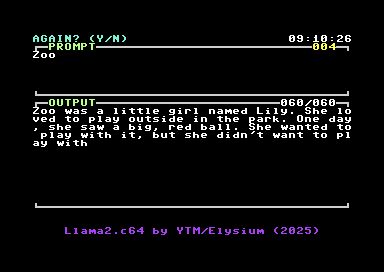
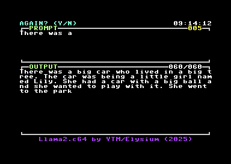

# Llama2.c64

Ported to C64 by Maciej 'YTM/Elysium' Witkowiak using [oscar64](https://github.com/drmortalwombat/oscar64)

Llama2.c64 is a port of [llama2.c](https://github.com/karpathy/llama2.c) to the Commodore C64 equipped with a 2MB REU.

It runs the [260K tinystories model](https://huggingface.co/karpathy/tinyllamas/tree/main/stories260K) bringing Llama2's capabilities to the unique C64 hardware environment.

This is not a chat model.

Rather, imagine prompting a 3-year-old child with the beginning of a story — they will continue it to the best of their vocabulary and abilities.

# Screenshots

## Parameter screen



## Prompt and output





# How to run it?

## VICE

Enable REU, set REU size to 2MB, and set REU image to the provided `weights.reu`. Load the program and turn on warp.

```
x64sc -warp -reu -reusize 2048 -reuimage weights.reu llama2c64.prg
```

## Ultimate II+

Enable REU in the Cartridge settings menu, with size at least 2MB. Navigate to location with `llama2.c64` and hit `<RETURN>` on `weights.reu` file.
There will be an option to load this image into REU.

Then start `llama2exo.prg` or `llama2c64.prg`.

# Building and Testing

The project includes a Makefile to simplify building and testing. Here are the available commands:

- `make build` - Compiles the source code with optimization level 2
- `make test` - Runs the program in VICE with the correct REU settings
- `make clean` - Removes built files and generated model files

The build process will automatically generate the required model files (`weights.reu`, `config.bin`, and `tokenizer.bin`) from the input files (`stories260K.bin` and `tok512.bin`) if they don't exist.

To build and run the program in one go, simply use:
```
make test
```

Exomizer is optional, needed to compress `llama2c64.prg` into smaller, easier to handle on real hardware `llama2exo.prg`.

# Pros

- Low power consumption
- On-premise inference
- Safe: **your** data is completely under **your** control, it's not used to train new models
- Doesn't require an expensive GPU
- Waiting for the next token on a C64 is just as exciting as waiting for one coming from DeepSeek running on your laptop

# Cons

- None really, this is fantastic
- Ram Expansion Unit (REU) with at least 2MB is necessary
- Feels a bit slow, not for the impatient
- Won't handle models larger than about 8MB, because REU is limited to 16MB

# Technical details

## Model

There are two parts to the model: tokenizer and model weights. For C64, they had to be processed a bit.

This preprocessing is done with the `generate-model-files.py` script.

The script will read the tokenizer and model weights and save the corresponding files:

- `tokenizer.bin` - tokenizer data with NULL-terminated strings, uint16_t vocabulary size and offsets, and with uint8_t string lengths
- `config.bin` - model parameters converted to uint16_t
- `weights.reu` - model weights (unchanged float32), a REU image padded to the next valid size (2MB, 4MB, 16MB)

Original model weights and tokenizer file came from the [tinyllamas](https://huggingface.co/karpathy/tinyllamas/tree/main/stories260K) repository. You will find there also training information.

Tinyllamas was trained on [TinyStories dataset](https://arxiv.org/abs/2305.07759), a synthetic dataset of short stories that only contain words that a typical 3 to 4-year-olds usually understand.

## Verification against `llama2.c`

Run llama2.c in deterministic mode (temperature=0.0) and try the same prompt on C64:

For example:
```
./run stories260K.bin -z tok512.bin -t 0 -i "Zoo" -n 60
```

In both cases, you should see
```
Zoo was a little girl named Lily. She loved to play outside in the park. One day, she saw a big, red ball. She wanted to play with it, but she didn't want to play with
```

## Memory

- The tokenizer and its encoding/decoding dictionaries fit within C64 memory (`tokenizer64.c`)
- Model weights and some of the data structures have to be in REU due to their size (`transformer64.c`)
- Some remaining data structures from `Transformer` also stayed within C64 memory

## `math.c`

I provide my own code for `my_sin`, `my_cos`, and `my_exp` for better accuracy than the ones that come with [oscar64](https://github.com/drmortalwombat/oscar64).
These polynomial factors are actually copied from C64 BASIC ROM.

## Branches

- `wrapped_debug` - development branch with lots of debug messages and data structure dumps for calculation comparisons with `llama2.c`, use that as a start for the quantized version; it also shows how much memory is used for each part (note: top-p sampler was not backported there)
- `feature-fastmult` - an attempt to speed up `float32` multiplication using `uint8_t` times table (64K in REU); it turned out to be twice as slow, but nevertheless can be useful for the quantized version

# FAQ

## Is this a joke?

No, it really runs the same set of calculations as [llama2.c](https://github.com/karpathy/llama2.c) and returns exactly the same results. A humble C64 runs the LLama2 model, it's only limited by the memory size.

There is plenty of information provided about this in the README of [llama2.c](https://github.com/karpathy/llama2.c).
You can [read more about Transformer models here](https://medium.com/@smmzhu/demystifying-the-transformer-model-cd73e1b7ac87).

## What's the performance like? I have been waiting here for 15 minutes and it does nothing

You will receive one output token approximately every 8 minutes. This is an estimation, the attention step depends on the number of tokens generated so far, so the process gets slower and slower.

The very first produced token is a start marker, so the text in the output will start appearing after 16 minutes. All the tokens from the input will be repeated in the output before any sampling starts.

## What do those parameters mean?

- `temperature` controls the randomness of the output, if set to `0.0` the result is deterministic
- `top-p` ensures that tokens with tiny probabilities do not get sampled. Lower values make the output more focused and deterministic, while higher values increase diversity, if set to `0.0` the feature is off. This setting has no effect if temperature is `0.0`
- `output tokens` controls the number of output tokens, one token may be more than one letter (e.g. `was` or `once` are tokens in the `tinystories` model); note that it's just a stop condition, it doesn't control the verbosity of the model

*To control the diversity of samples, use either the temperature or the top-p value, but not both. Vary the temperature between 0.0 and 1.0 and keep top-p off (set to 0.0), or vary the top-p value between 0.0 and 1.0 and keep the temperature at 1.0.*

## What is the yellow number under the clock?

That's the number of input tokens. In this model, the input tokens are first all copied to output before any sampling happens.

## How to compile it?

`oscar64` wants everything in one file, so it's just:
```
oscar64 -O2 llama2c64.c
```
Do not use other optimizations besides `-O0`, `-O1`, or `-O2`, they break the program.

`Makefile` has everything you need to rebuild model files and recompile the program.

## Can it run faster?

Yes, but just a bit. Several things can be optimized, but the truth is - it doesn't matter. The program spends most of the time in one of the three matrix multiplication functions. Optimizing anything else is a waste of time.

## Will it run faster with SCPU?

Certainly faster, but the results are wrong when SCPU is in turbo mode. I didn't investigate why. (Tested with VICE)

## What about a quantized model?

If you can provide a pull request for a quantized int8 model, be my guest :)

## Can I chat with it?

# License

MIT

No, it's not a model instructed and trained for chat. It can only tell a short story.

## Clock doesn't advance

Your CIA is broken or 9VAC is missing.
